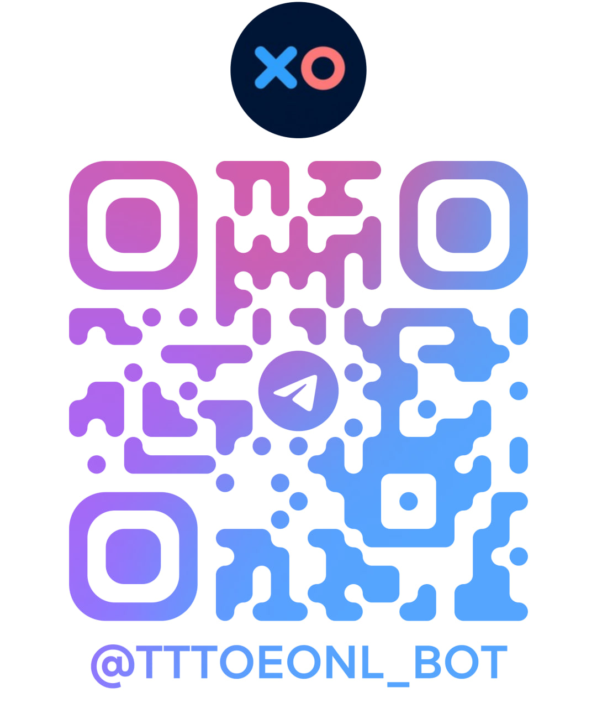

# Tic-Tac-Toe для Telegram Web App

Кроссплатформенная игра «крестики-нолики» запускается прямо внутри Telegram как Web App. Пользователь открывает бота, авторизуется через Telegram Web App SDK и подключается к серверу по WebSocket, чтобы играть в реальном времени. [Сайт игры](https://tttoeonl.ru/)

## Кратко о проекте
- **Бэкенд**: Node.js + Express предоставляет API/WS, валидирует подписи Telegram Web App, управляет матчмейкингом и игровой сессией.
- **Frontend (production)**: единственный runtime-клиент собирается из `client/` в `client/dist` (React + Vite).
- **Данные**: PostgreSQL хранит профили, статистику и достижения игроков.
- **Инфраструктура**: защита заголовков через Helmet, ограничение запросов, мониторинг, миграции БД через скрипты Node.js.

## Связка бэкенда и фронтенда
1. SPA-фронтенд (production build: `client/dist`) подключается к backend по HTTP (REST) и WebSocket.
2. Telegram Web App SDK передаёт данные авторизации; backend проверяет подпись, создаёт/обновляет профиль и ставит игрока в очередь.
3. Игровые события (поиск соперника, ходы, завершение игры) идут через WebSocket; backend валидирует действия и синхронизирует состояние у обоих игроков.
4. Результаты матчей сохраняются в PostgreSQL; статистика и достижения доступны через REST-эндпоинты `/leaders` и `/profile/:id`.
5. Legacy-клиент удалён; в production поддерживается только React/Vite frontend из `client/`.

## Структура файлов
```
.
├── client/              # Актуальный фронтенд (React + Vite)
│   ├── src/             # Исходники фронтенда
│   ├── public/          # Статические ассеты для Vite
│   ├── dist/            # Production-сборка фронтенда (build output)
│   └── package.json
├── docs/                # Документация по миграции и инвентаризации
│   └── legacy-client-inventory.md
├── public/              # Статические ассеты (изображения)
│   └── img/
├── server/              # Бэкенд и вспомогательные модули
│   ├── index.js         # Точка входа HTTP + WebSocket backend-сервиса
│   ├── db.js            # Подключение к PostgreSQL и запросы
│   ├── migrate.js       # Скрипт применения миграций
│   ├── telegramAuth.js  # Проверка подписи Telegram Web App
│   ├── achievements.js  # Работа с достижениями
│   ├── validation.js    # Валидация входных данных
│   ├── rateLimit.js     # Ограничение запросов
│   ├── monitoring.js    # Логирование и метрики
│   └── errorHandler.js  # Единая обработка ошибок
├── migrations/          # SQL-миграции для схемы БД
├── package.json         # Скрипты backend в корне
├── package-lock.json
├── netlify.toml         # Конфигурация деплоя frontend на Netlify
├── QRcode.jpg
└── README.md
```

## Технологии
- Node.js 18+
- Express, Helmet, CORS
- WebSocket (ws)
- PostgreSQL (pg)
- Telegram (бот для выдачи Web App)
- React + Vite + Telegram Web App SDK

## Как запустить локально
1. Установите зависимости в корне: `npm install`.
2. Установите зависимости фронтенда: `cd client && npm install`.
3. Создайте `.env` с настройками:
   - `PORT` — порт HTTP/WS (по умолчанию 8080);
   - `BOT_TOKEN` — токен Telegram-бота;
   - `TELEGRAM_INITDATA_TTL_SEC` — TTL для Telegram `initData` в секундах (по умолчанию `600`, то есть 10 минут). Если `auth_date` старше TTL, данные авторизации отклоняются;
   - `PUBLIC_URL` — внешний URL для Web App (если отличается от локального);
   - `CORS_ORIGINS` — CSV-список разрешённых Origin для backend API (поддерживаются маски вида `https://*.netlify.app`, localhost разрешён для dev автоматически), например: `https://app.example.com,https://*.netlify.app`;
   - параметры подключения к PostgreSQL (`DATABASE_URL` или `PGHOST`, `PGPORT`, `PGUSER`, `PGPASSWORD`, `PGDATABASE`, `PGSSL`);
   - frontend-переменные (в этом же корневом `.env`): `VITE_API_BASE_URL` и `VITE_WS_URL`.
4. Примените миграции: `npm run migrate` (создаст таблицы для пользователей, статистики и достижений).
5. Запустите backend (из корня репозитория): `npm run start`.
6. Запустите frontend в режиме разработки:
   - `cd client`
   - `npm run dev`
7. Production-сборка frontend:
   - `cd client`
   - `npm run build`

## Deployment topology
- **Frontend (Netlify)**:
  - Источник: `client/`
  - Команда сборки: `npm run build`
  - Публикуемая директория: `client/dist`
- **Backend (отдельный API/WS сервис)**:
  - Запуск из корня: `npm run start`
  - Предоставляет REST API и WebSocket endpoint для frontend.
- **Legacy слой**:
  - удалён из runtime; детали миграции: `docs/legacy-client-inventory.md`.

## Деплой фронтенда на Netlify
- Для фронтенда из папки `client/` добавлен `netlify.toml` в корне репозитория.
- Подробная пошаговая инструкция: `NETLIFY_SETUP.md`.

## QR-код бота
QR ведёт прямо к игровому боту в Telegram. Размер уменьшен для удобного отображения:



## Лицензия
MIT — см. файл `LICENSE`.
